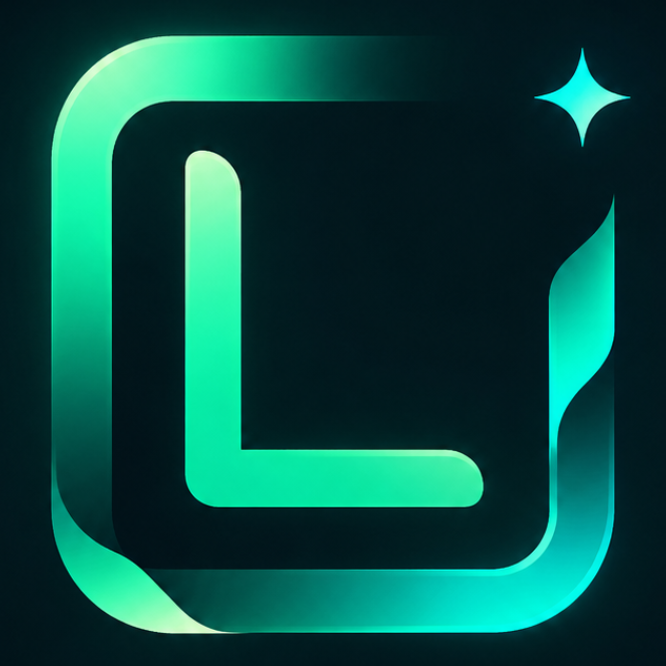
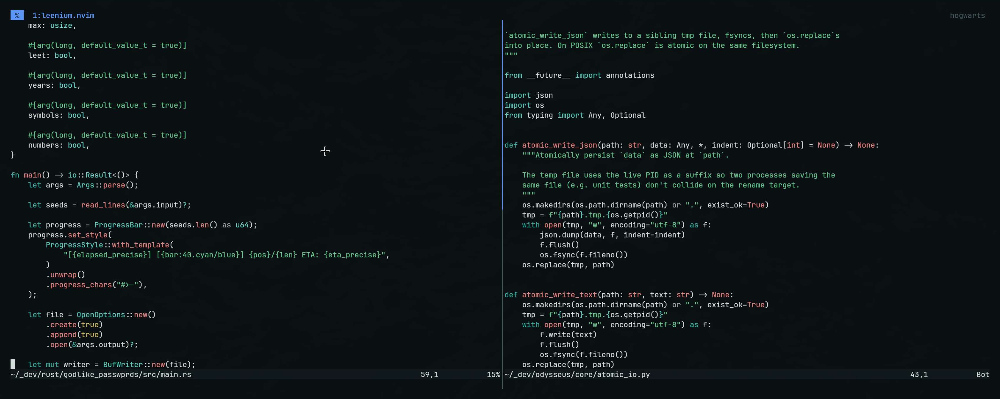
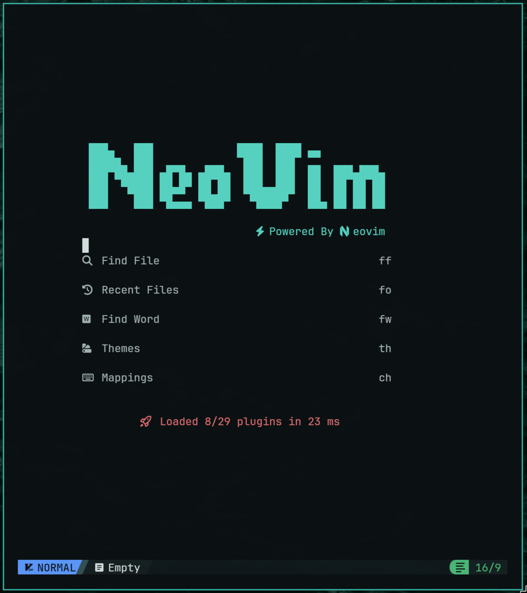

<div align="center">

# Leenium Neovim



**A dark Neovim colorscheme built from the exact Leenium palette used by VS Code.**

Hosted under `github.com/drunkleen/leenium.nvim`.





</div>

---

## Features

- **Exact palette match** - shares the same hex values as `leenium.vscode`
- **Dark canvas** - low-glare background for long coding sessions
- **Semantic coverage** - types, functions, keywords, strings, numbers, operators, and punctuation are styled
- **UI coverage** - floating windows, tabs, status line, Telescope, diagnostics, and file tree all follow the palette
- **Part of Leenium** - matches the broader Leenium desktop stack

---

## Installation

**lazy.nvim**

```lua
{
  "drunkleen/leenium.nvim",
  priority = 1000,
  config = function()
    vim.cmd.colorscheme("leenium")
  end,
}
```

**packer.nvim**

```lua
use {
  "drunkleen/leenium.nvim",
  config = function()
    vim.cmd.colorscheme("leenium")
  end,
}
```

---

## Usage

```lua
vim.cmd.colorscheme("leenium")
```

Or call the loader directly:

```lua
require("leenium").load()
```

---

## The Leenium Ecosystem

Leenium is a unified dark desktop environment built around the same color palette. Alongside this Neovim theme, the project ships matching configs for:

- **VS Code** - editor theme and UI palette
- **Waybar** - status bar for Wayland compositors
- **btop** - resource monitor
- **Chromium** - browser theme
- **Firefox** - browser theme
- **SwayOSD** - on-screen display overlays

Visit [github.com/drunkleen](https://github.com/drunkleen) to explore the full setup.

---

## Theme

### leenium

Shared Leenium palette.

| Role | Hex |
|------|-----|
| Background | `#0b1113` |
| Panel | `#11191c` |
| Foreground | `#d8e3e0` |
| Accent | `#33b8a8` |
| Cyan | `#59d6c5` |
| Sea | `#4dba7a` |
| Sea bright | `#67cf94` |
| Type | `#71e4d8` |
| Warn | `#d9c76b` |
| Warn bright | `#efd45e` |
| Orange | `#f4a259` |
| Error | `#e16f73` |
| Error soft | `#f08787` |
| Muted | `#718688` |
| Blue | `#5e9bff` |

---

## The Leenium Ecosystem

Leenium is a unified dark desktop environment built around the same color palette. Alongside this Waybar theme, the project ships matching configs for:

- [**Firefox**](github.com/drunkleen/leenium.firefox) - browser theme extension
- [**Ghidra**](github.com/drunkleen/leenium.ghidra) - reverse engineering framework theme
- [**Hyprlock**](github.com/drunkleen/leenium.hyprlock) - hyprland lockscreen
- [**Limine**](github.com/drunkleen/leenium.limine) - BootLoader
- [**Omarchy**](github.com/drunkleen/leenium.omarchy) - desktop theme bundle
- [**OpenCode**](github.com/drunkleen/leenium.opencode) - terminal-first theme
- [**VS Code**](github.com/drunkleen/leenium.vscode) - editor theme and UI palette
- [**Waybar**](github.com/drunkleen/leenium.waybar) - editor theme and UI palette

Visit [github.com/drunkleen](https://github.com/drunkleen) or [leenium.drunkleen.com](https://leenium.drunkleen.com/) to explore the full setup.

---

## License

MIT © [Leenium](LICENSE)
